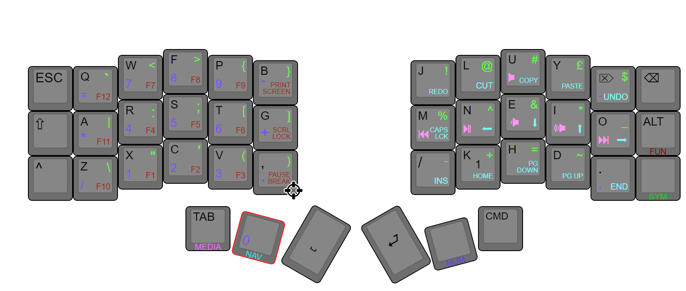
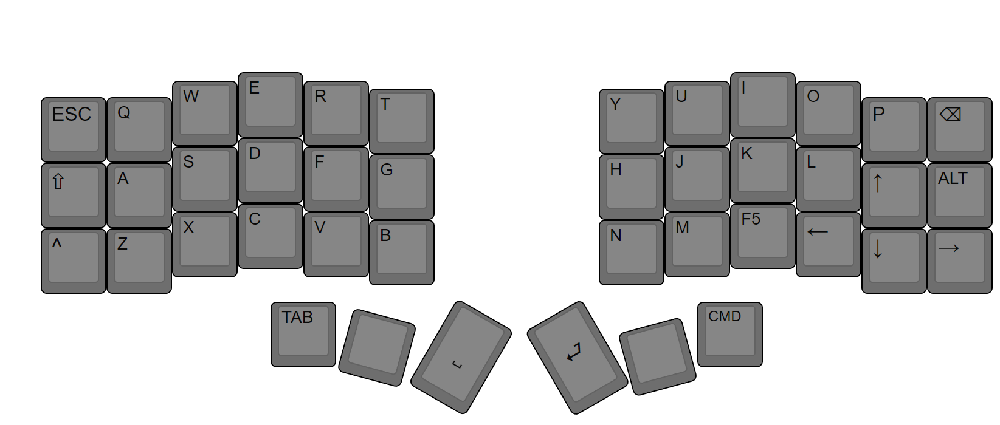

# Corne Miryoku-like Layout

Based off the Miryoku layout, this is my personal preference for a layered Colemak-dh Corne keyboard.

I have notably moved the K and H keys one to the right, and moved the D to the right of these, as well as moving the V letter one to the left. this is due to two reasons, one for symmetry, five keys on the row to the left, and two keys to the right always felt strange to me. And secondly my hands tend move when I attemped to use the V and K keys on the original layout, so I moved these across one and instead use these for common punctuation keys. The placement of the D is a little strange, I may swap this with the J key.

I also included a "Gaming mode". When the TAB and CMD keys are pressed together this most is enabled/disabled. This means I can play most games without having to remap any keys within the game itself.

[keymap-editor]:https://github.com/nickcoutsos/keymap-editor
[keymap-layout-tools]:https://nickcoutsos.github.io/keymap-layout-tools/
[`config/corne.keymap`]:config/corne.keymap
[`config/corne.json`]:config/corne.json
[template]:https://github.com/nickcoutsos/keymap-editor-demo-crkbd/generate
